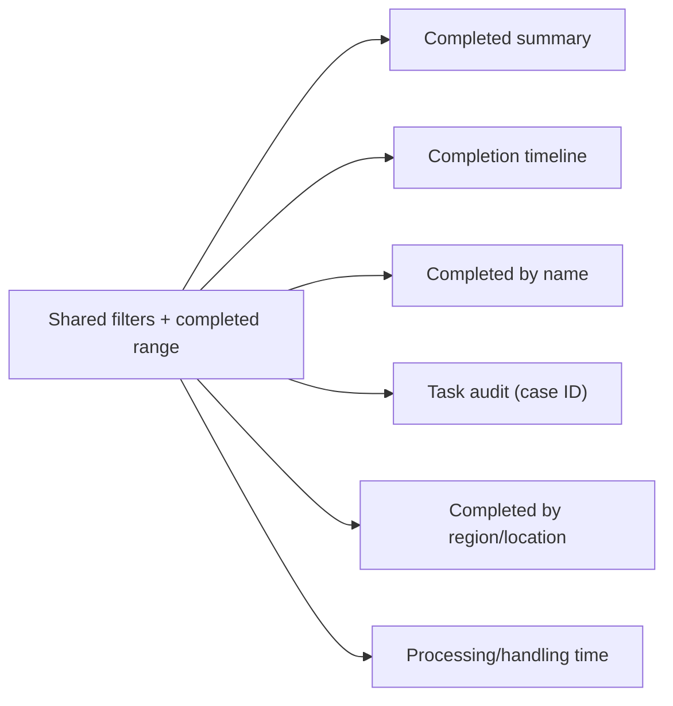

# Functional specification: Tasks completed dashboard

## Purpose
Provide analytics on completed tasks, compliance with due dates, and timing metrics.

## URL
- `/analytics/completed`

## Filters
- Shared filters: service, role category, region, location, task name.
- Date range filters for completed tasks:
  - Completed from (`completedFrom`)
  - Completed to (`completedTo`)

## Sections and behaviors

### 1) Completed tasks summary
- Two summary panels:
  - "Completed tasks (today)"
  - "Completed tasks within date range"
- Each panel shows totals plus within/beyond due date counts.
- Each panel has a donut chart for within vs beyond due date.

### 2) Tasks completed timeline
- Title: "Tasks completed".
- Chart: stacked bar (within vs beyond due date) plus a 7-day rolling average line.
- Table columns:
  - Completed date
  - Tasks
  - Within due date
  - %
  - Outside due date
  - 7-day rolling average tasks

### 3) Completed by name
- Chart: stacked horizontal bar (within vs beyond due date) by task name.
- Table columns:
  - Task name
  - Tasks
  - Within due date
  - %
  - Beyond due date

### 4) Task audit
- Purpose: audit tasks by case ID.
- Form: case ID input; uses current filters and date range.
- Table columns:
  - Case ID (link to Manage Case)
  - Task name
  - Agent name
  - Completed date
  - Total assignments
  - Location
  - Status (termination process label)
- Empty state:
  - If no case ID, prompt user to enter one.
  - If case ID provided but no results, show "No completed tasks match this case ID."

### 5) Completed by region/location
- Tabbed tables:
  - By region and location
  - By region
  - By location
- Columns include total tasks, within due, beyond due, and average handling/processing time where available.

### 6) Processing and handling time
- Metric selector (radio buttons):
  - Handling time: days between assignment and completion.
  - Processing time: days between creation and completion.
- Selecting a metric triggers an auto-submit for this section only.
- Displays:
  - Overall average for the selected metric.
  - Chart: average with upper/lower range (+/- 1 standard deviation) by completed date.
  - Table with the same data.

## Notes
- All tables include CSV export.
- Filters apply to all sections; the metric selector only changes the timing chart/table.
