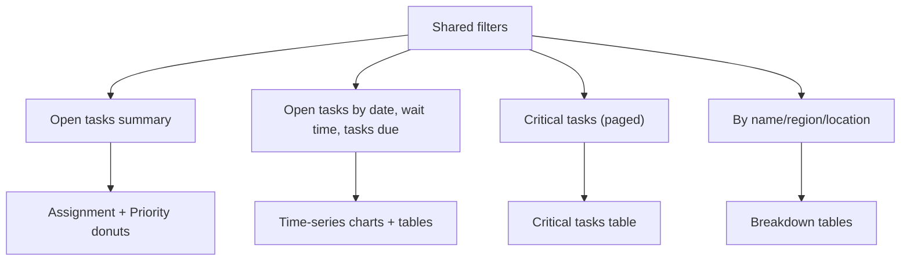

# Functional specification: Tasks outstanding dashboard

## Purpose
Provide detail on tasks that are open or otherwise not completed, including priority, wait time, and location/region breakdowns.

## URL
- `/outstanding`

## Filters
- Shared filters: service, role category, region, location, work type, task name.
- No date range filters on this page (other than due dates within the data itself).

## Sections and behaviors

### 1) Open tasks summary
- Title: "Open tasks".
- Summary values:
  - Total, Assigned, Unassigned
  - Urgent, High, Medium, Low
- Two donut charts:
  - Assignment (Assigned vs Unassigned)
  - Priority (Urgent/High/Medium/Low)

### 2) Open tasks by created date
- Title: "Open tasks".
- Chart: stacked bar time series by created date (Assigned vs Unassigned).
- Chart axes: x-axis `Created date`; y-axis `Tasks`.
- Table columns:
  - Created date
  - Open tasks
  - Assigned tasks
  - Assigned %
  - Unassigned tasks
  - Unassigned %
- Default table sort is Created date ascending.

### 3) Wait time by assigned date
- Title: "Wait time".
- Chart: line chart of average wait (days) by assigned date.
- Chart axes: x-axis `Assigned date`; y-axis `Days`.
- Population: currently assigned open tasks only (`state = ASSIGNED`).
- Table columns:
  - Assigned date
  - Assigned count
  - Average wait (days)
- Average wait values in the table are displayed to 2 decimal places.
- Default table sort is Assigned date ascending.

### 4) Critical tasks
- Title: "Critical tasks".
- Table only, with server-side sorting and pagination.
- Columns:
  - Case ID (link to Manage Case)
  - Case type
  - Location
  - Task name
  - Created date
  - Due date
  - Priority
  - Agent name
- Priority values are displayed as sentence case labels: `Urgent`, `High`, `Medium`, `Low`.
- Agent name displays `Judge` when an assignee ID is present but has no matching Staff Ref Data profile.
- Priority sorting uses severity ranking (Urgent > High > Medium > Low), with first-click descending on the Priority header.
- Priority cells carry numeric sort metadata so client-side enhancements keep the same severity ordering.
- Sort order defaults to due date ascending.
- Pagination page size: 50.
- Long `Location` and `Task name` values wrap across multiple lines in table body rows.

### 5) Tasks due
- Title: "Tasks due".
- Chart: stacked bar time series (Open vs Completed by due date).
- Chart axes: x-axis `Due date`; y-axis `Tasks`.
- Table columns:
  - Due date
  - Total due
  - Open
  - Completed
- Default table sort is Due date ascending.

### 6) Open tasks priority
- Title: "Open tasks priority".
- Chart: stacked bar time series of open tasks due by priority.
- Chart axes: x-axis `Due date`; y-axis `Tasks`.
- Table columns:
  - Due date
  - Total open
  - Urgent
  - High
  - Medium
  - Low
- Default table sort is Due date ascending.

### 7) Open tasks by name
- Title: "Open tasks by name".
- Chart: stacked horizontal bar by task name (Urgent/High/Medium/Low).
- Table columns:
  - Task name
  - Total open
  - Urgent
  - High
  - Medium
  - Low
- Uses an initial payload embedded in the page for fast load.
- Default table sort is Urgent descending (with total tasks and then task name used as tie-breakers).

### 8) Tasks outstanding by region or location
- Title: "Tasks outstanding by region or location".
- Tabbed tables:
  - By region and location
  - By region
  - By location
- Columns include counts for total open tasks and each priority bucket.

## Notes
- CSV export is available for each table section.
- Filters are applied consistently across all sections.
- Priority charts (open tasks priority donut, open tasks priority by due date, open tasks by name) use a GOV.UK palette mapping of Urgent `#98285d` (purple), High `#16548a` (dark blue), Medium `#8eb8dc` (light blue), and Low `#cecece` (light grey).
- Dates are displayed as `D Mon YYYY` in tables/charts, while date sorting and CSV export use ISO `YYYY-MM-DD` values.
