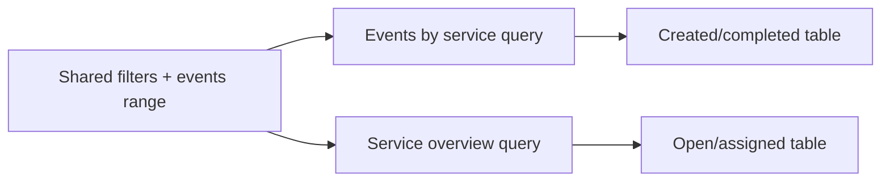

# Functional specification: Overview dashboard

## Purpose
Provide a high-level view of service performance, focusing on open and assigned tasks and recent task events by service.

## URL
- `/`

## Filters
- Shared filters: service, role category, region, location, task name, work type.
- Task events date range:
  - Events from (`eventsFrom`)
  - Events to (`eventsTo`)
  - Default range when unset: last 30 days ending today.

## Sections and behaviors

### 1) Open and assigned tasks by service
- Title: "Open and assigned tasks by service".
- Data table only (no chart tab).
- Columns:
  - Service
  - Open
  - Assigned
  - Assigned %
  - Urgent
  - High
  - Medium
  - Low
- Totals row pinned at the bottom when table is sorted.
- Data is aggregated from task daily facts; filters apply.

### 2) Created and completed tasks by service
- Title: "Created and completed tasks by service".
- Includes its own date range form (eventsFrom/eventsTo).
- Uses AJAX to refresh only this section when date range changes.
- Columns:
  - Service
  - Created
  - Completed
- Totals row included.
- Cancelled events continue to be aggregated in backend data for future use but are not currently displayed.

## Notes
- The dashboard is designed for broad monitoring rather than deep drill-down.
- All values are numeric and formatted for readability.
