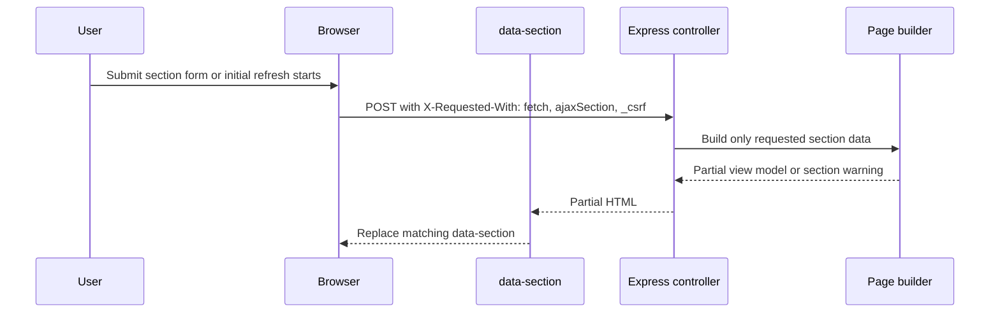

# Functional specification: Shared dashboard behaviour

This document defines behaviour common to analytics dashboard pages. Page-specific specifications only describe differences and section-level behaviour.

## Shared filters

Shared filters appear on analytics dashboard pages and provide multi-select dropdowns for:

- Service
- Role category
- Region
- Location
- Work type
- Task name
- User on User overview only

Behaviour:

- Filters support search, "select all", and dynamic summary text.
- Filter options are faceted: each filter's available options are constrained by the current selections in the other shared filters.
- When selections change inside a shared-filter multi-select, closing that dropdown triggers an AJAX refresh of the shared-filter section only.
- During facet refresh, the filter being edited remains authoritative while other shared filters are canonicalised to compatible values; incompatible selections are removed.
- Selecting all items is normalised to `All` to avoid storing large filter payloads.
- Filters are persisted in a signed cookie and re-applied on subsequent visits.
- Reset uses a form submit flag (`resetFilters=1`), clears persisted filter cookies, and does not leave a `resetFilters` query parameter in the browser URL.
- Submitting shared filters clears any active URL hash fragment before navigation so the page does not jump to an old anchor after reload.

Date filters are page-specific:

- Overview uses `eventsFrom` and `eventsTo`.
- Completed and User overview use `completedFrom` and `completedTo`.
- Outstanding has no explicit date-range filter.

## Charts and tables

- Most sections offer tabbed "Chart" and "Data table" views.
- Charts are rendered with Plotly using the GOV.UK-aligned palette defined in shared chart helpers.
- Data tables provide accessible alternatives to charts.
- CSV export is built client-side from the visible table.
- CSV export prefers `data-export-value` when present so visible formatted dates can export as ISO values.
- Sortable date cells use ISO `YYYY-MM-DD` values in `data-sort-value`.
- Server-sorted priority columns use numeric sort metadata so client-side table enhancement preserves severity ordering.

## Sorting and pagination

- Some tables support server-side sorting through column headers.
- Critical tasks and User overview tables support pagination.
- Sort and pagination state is stored in hidden inputs in the filter form and sent with each request.
- Backend pagination is capped to the first 500 matching rows.
- Page requests beyond the capped window are clamped to the last allowed page before the database query runs.

## Partial refresh

Each dashboard is composed of sections that can refresh independently.

AJAX contracts:

- Initial page load can render placeholders and mark sections with `data-ajax-initial`.
- Initial section refreshes are queued client-side with a concurrency limit of 2 in-flight requests.
- When a filter is submitted with `X-Requested-With: fetch`, the server returns the relevant partial only.
- Each partial has a `data-section` ID that ties the response to the correct HTML fragment.
- URL-encoded form data must include `_csrf` so CSRF validation can pass.
- A newer request for the same section aborts the older one.
- `pagehide` aborts in-flight analytics section requests when the user leaves the page.

## Error and empty states

- If a section query fails but the page can safely render, the response remains HTTP 200 and the affected section shows an inline warning state.
- Server-rendered warning states are represented through `sectionErrors`.
- If an AJAX section refresh fails with a transport or server error, the failure is contained to that section and a retry control is shown.
- Full-page navigation is reserved for hard failures such as missing section targets, login redirects, forbidden responses, or CSRF/session failures.
- Sections may define page-specific empty states, such as task audit without a case ID.
