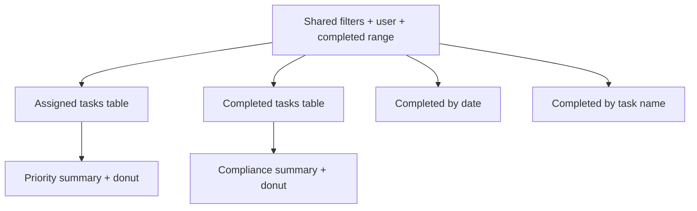

# Functional specification: User overview dashboard

## Purpose
Provide a user-centric view of assigned and completed tasks, including compliance and performance metrics.

## URL
- `/users`

## Filters
- Shared filters: service, role category, region, location, work type, task name.
- User filter (assignee).
- Date range filters for completed tasks: completedFrom/completedTo.

## Sections and behaviors

### 1) Currently assigned tasks
- Title: "Currently assigned tasks".
- Table with server-side sorting and pagination.
- Columns:
  - Case ID (link to Manage Case)
  - Created date
  - Task name
  - Assigned date
  - Due date
  - Priority
  - Total assignments
  - Assignee
  - Location
- Summary panel:
  - Total assigned
  - Priority breakdown (Urgent/High/Medium/Low)
- Donut chart of priority distribution.
- Pagination page size: 50.
- Long `Task name` and `Location` values wrap across multiple lines in table body rows.

### 2) Completed tasks
- Title: "Completed tasks".
- Table with server-side sorting and pagination.
- Columns:
  - Case ID (link to Manage Case)
  - Created date
  - Task name
  - Assigned date
  - Due date
  - Completed date
  - Handling time (days)
  - Within due date (Yes/No)
  - Total assignments
  - Assignee
  - Location
- Summary panel:
  - Completed total
  - Within due date
  - Beyond due date
- Donut chart for within vs beyond due date.

### 3) Completed tasks by date
- Title: "Completed tasks by date".
- Chart: stacked bar (within vs beyond due date) with a line for average handling time (days).
- Table columns:
  - Completed date
  - Tasks
  - Within due date
  - %
  - Outside due date
  - Average handling time (days)

### 4) Completed tasks by task name
- Title: "Completed tasks by task name".
- Table columns:
  - Task name
  - Tasks
  - Average handling time (days)
  - Average days beyond due date
- Default table sort is Tasks descending.

## Notes
- CSV export is available for all tables.
- The user filter is optional; if not selected, results span all users.
- Sorting state and pagination are preserved through hidden form inputs.
- The priority donut uses the GOV.UK palette mapping Urgent `#98285d` (purple), High `#16548a` (dark blue), Medium `#8eb8dc` (light blue), and Low `#cecece` (light grey).
- Dates are displayed as `D Mon YYYY` in the UI, while date sorting and CSV export continue to use ISO `YYYY-MM-DD` values.
