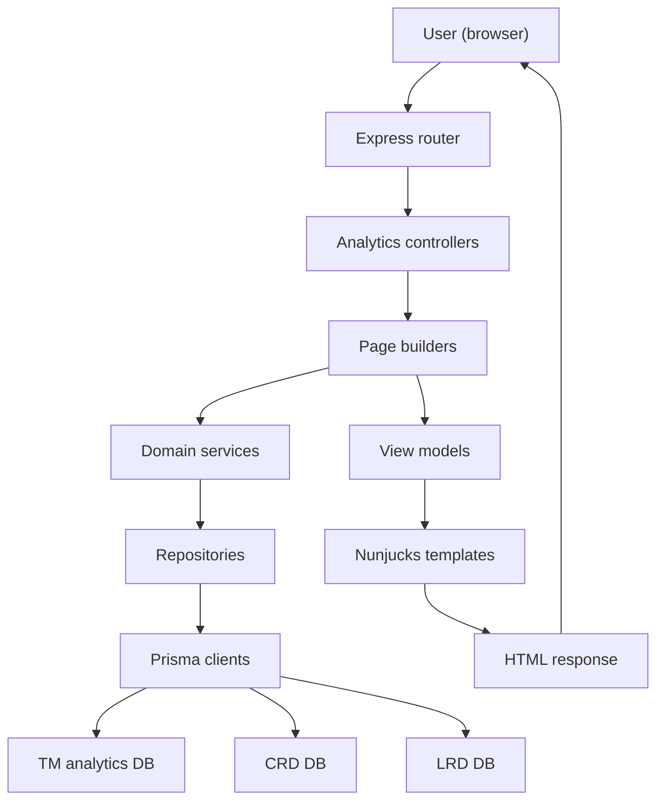

# Technical architecture

## High-level overview
The application is a Node.js + Express 5 server that renders Nunjucks templates, serves static assets, and provides read-only analytics dashboards. Data is fetched from PostgreSQL databases using Prisma clients and raw SQL against analytics views.

Key runtime components:
- Express application (`src/main/app.ts`)
- Nunjucks templating (`src/main/modules/nunjucks`)
- Analytics modules with controller/service/viewModel separation (`src/main/modules/analytics`)
- Static assets built with webpack and served from `src/main/public`
- Optional OIDC authentication and RBAC (`src/main/modules/oidc`)

## Request lifecycle
1. Express initializes middleware: body parsing, cookies, optional compression (`compression.enabled`), webpack dev middleware in development, static assets, caching headers.
2. Health (`/health`) and info (`/info`) endpoints are registered.
3. Session middleware is initialized (AppSession).
4. Optional OIDC middleware enforces authentication and RBAC access role.
5. Analytics routes are registered on `/`.
6. Requests are rendered via Nunjucks templates.
7. Errors are handled with GOV.UK-friendly error pages.

## Routing
- `src/main/routes/index.ts` registers analytics router at `/`.
- Analytics router (`src/main/modules/analytics/index.ts`) defines:
  - `/` (Overview)
  - `/outstanding`
  - `/completed`
  - `/users`
- Health endpoint: `/health`.
- Info endpoint: `/info`.

## Module structure
Analytics pages follow a common module structure:
- `controller.ts`: HTTP entrypoint and route wiring.
- `page.ts`: page composition, async data fetching, and fallbacks.
- `service.ts`: domain-level aggregation or calculations.
- `viewModel.ts`: shapes data for templates.
- `visuals/`: chart builders and data-fetching services.

Shared analytics modules live under `src/main/modules/analytics/shared` and include:
- Filters, pagination, sorting helpers
- Chart builders and color palette
- Cache and service helpers
- Repositories and Prisma data access

## Environments
- Development mode: `NODE_ENV=development` enables webpack dev middleware and mounts it before static assets so in-memory bundles are served ahead of on-disk files.
- Production mode: `NODE_ENV=production` expects built assets in `dist/main` and `src/main/public`.
- Server port defaults to 3100 (configurable via `PORT`).

## Error handling
- Unknown routes return a "not found" page.
- Errors return custom GOV.UK-style error pages.
- HTTP 401 and 403 render access-specific messaging with sign-out links.
