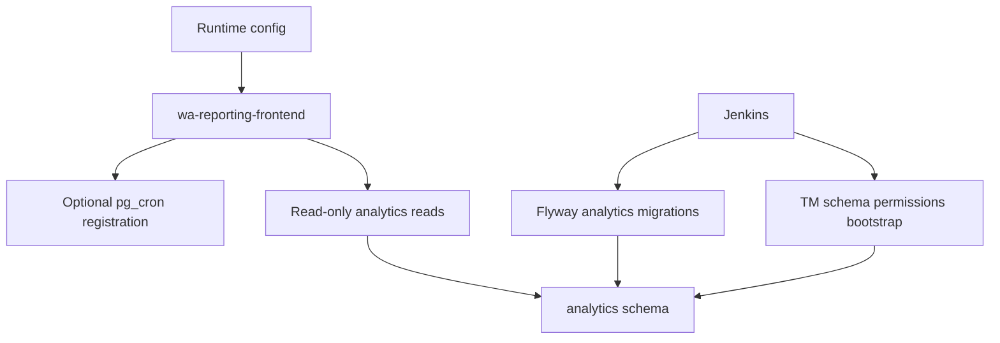

# Configuration and operations

This is the entry point for configuration, runtime, deployment, and operational runbooks.

## Read first

- [Configuration reference](configuration.md): configuration files, precedence, key areas, environment variables, secrets, and Redis dependency.
- [Runtime and build](runtime-and-build.md): package management, builds, running, health endpoints, logging, and monitoring.
- [Deployment and CI](deployment-and-ci.md): current repository CI/Jenkins behaviour and verification gaps.
- [Flyway runbook](operations/flyway.md): analytics migration model and baseline behaviour.
- [Local database runbook](operations/local-database.md): opt-in Docker Postgres, Flyway-backed local rebuilds, seeded data, and local app startup.
- [Snapshot refresh runbook](operations/snapshot-refresh.md): startup pg_cron registration and refresh runtime notes.
- [Schema permissions runbook](operations/schema-permissions.md): rerunnable analytics reader grants.

## Operational boundaries

- Runtime application startup loads configuration, sessions, telemetry, and optional pg_cron bootstrap.
- Runtime startup does not apply Flyway migrations.
- Flyway remains a Jenkins-run concern.
- TM schema permissions bootstrap remains an external script/runbook concern.
- The frontend service is read-only against downstream analytics data.
- The aggregate health endpoint derives the IDAM health check from `services.idam.url.public` plus `/health`; no custom IDAM health timeout or deadline setting is configured.

