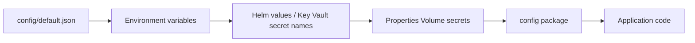

# Configuration reference

## Configuration files

- `config/default.json` defines defaults for all runtime configuration, including local development defaults.
- `config/custom-environment-variables.yaml` maps config keys to environment variables for overrides.
- `charts/wa-reporting-frontend/values.yaml` and `charts/wa-reporting-frontend/values.preview.template.yaml` define Key Vault secret names injected into the app in non-local environments and the optional in-cluster Redis chart used by preview.

## Configuration flow and precedence



Precedence:

1. `config/default.json` provides baseline values.
2. Environment variables wired through `config/custom-environment-variables.yaml` override defaults.
3. In production-like environments, Key Vault secrets are declared in Helm values and loaded through Properties Volume under `secrets.wa.<secret-name>`.
4. Application code reads secrets directly from `secrets.wa.<secret-name>` paths.

Use the `config` package with dot-notation keys that match `config/default.json` paths:

```ts
import config from 'config';

const redisHost: string | undefined = config.get('secrets.wa.wa-reporting-redis-host');
const ttlSeconds: number = config.get<number>('analytics.cacheTtlSeconds');

if (config.has('secrets.wa.app-insights-connection-string')) {
  const connectionString = config.get<string>('secrets.wa.app-insights-connection-string');
}
```

Prefer `config.get<T>(...)` with explicit types for clarity, and `config.has(...)` when a value is optional.

## Key configuration areas

### Analytics

| Config key | Purpose | Environment variable |
| --- | --- | --- |
| `analytics.cacheTtlSeconds` | NodeCache TTL for filter options and reference data | `ANALYTICS_CACHE_TTL_SECONDS` |
| `analytics.publishedSnapshotCacheTtlSeconds` | NodeCache TTL for current published snapshot metadata | `ANALYTICS_PUBLISHED_SNAPSHOT_CACHE_TTL_SECONDS` |
| `analytics.manageCaseBaseUrl` | Base URL used for case links | `MANAGE_CASE_BASE_URL` |
| `analytics.filtersCookieName` | Analytics filter persistence cookie name | `ANALYTICS_FILTERS_COOKIE_NAME` |
| `analytics.filtersCookieMaxAgeDays` | Filter cookie lifetime in days | `ANALYTICS_FILTERS_COOKIE_MAX_AGE_DAYS` |
| `analytics.locationReferenceSync.enabled` | Enables app-managed LRD court venue lookup sync into analytics tables | `ANALYTICS_LOCATION_REFERENCE_SYNC_ENABLED` |
| `analytics.locationReferenceSync.intervalSeconds` | Periodic location reference sync interval; defaults to 10800 seconds, with a minimum runtime interval of 60 seconds | `ANALYTICS_LOCATION_REFERENCE_SYNC_INTERVAL_SECONDS` |
| `analytics.snapshotRefreshCronBootstrap.enabled` | Enables startup registration of snapshot refresh pg_cron jobs | `SNAPSHOT_REFRESH_CRON_BOOTSTRAP_ENABLED` |
| `analytics.snapshotRefreshCronBootstrap.jobName` | pg_cron job name used for idempotent replace behaviour | `SNAPSHOT_REFRESH_CRON_JOB_NAME` |
| `analytics.snapshotRefreshCronBootstrap.schedule` | Cron expression used for snapshot refresh execution | `SNAPSHOT_REFRESH_CRON_SCHEDULE` |
| `analytics.snapshotRefreshCronBootstrap.targetDatabase` | Database where `analytics.run_snapshot_refresh_batch()` executes | `SNAPSHOT_REFRESH_CRON_TARGET_DATABASE` |
| `analytics.snapshotRefreshCronBootstrap.cronDatabase` | Database where pg_cron metadata/functions are available | `SNAPSHOT_REFRESH_CRON_DATABASE` |

### Authentication

| Config key | Purpose | Environment variable or secret |
| --- | --- | --- |
| `auth.enabled` | Enables/disables OIDC and RBAC | `AUTH_ENABLED` |
| `services.idam.clientID` | IDAM client ID | `IDAM_CLIENT_ID` |
| `services.idam.scope` | IDAM client scope | `IDAM_CLIENT_SCOPE` |
| `services.idam.url.public` | IDAM base URL | `IDAM_PUBLIC_URL` |
| `services.idam.url.wa` | Base URL of this application | `WA_BASE_URL` |
| `services.roleAssignment.url` | Role Assignment Service base URL | `ROLE_ASSIGNMENT_SERVICE_URL` |
| `services.s2s.url` | Service Auth Provider base URL | `IDAM_S2S_URL` |
| `RBAC.access` | Required role for access | `RBAC_ACCESS` |
| `RBAC.roleAssignmentRoleNames` | Comma-separated RAS role names that grant access | `RBAC_ROLE_ASSIGNMENT_ROLE_NAMES` |
| `secrets.wa.wa-reporting-frontend-client-secret` | IDAM client secret | `WA_REPORTING_FRONTEND_CLIENT_SECRET` |
| `secrets.wa.wa-reporting-frontend-s2s-secret` | S2S microservice secret for `wa_reporting_frontend` | `WA_REPORTING_FRONTEND_S2S_SECRET` |

### Session and Redis

| Config key | Purpose | Environment variable or secret |
| --- | --- | --- |
| `secrets.wa.wa-reporting-frontend-session-secret` | Session signing secret | `SESSION_SECRET` |
| `session.cookie.name` | OIDC session cookie name | `SESSION_COOKIE_NAME` |
| `session.appCookie.name` | App session cookie name | `SESSION_APP_COOKIE_NAME` |
| `secrets.wa.wa-reporting-redis-host` | Redis host | `REDIS_HOST` |
| `secrets.wa.wa-reporting-redis-port` | Redis port | `REDIS_PORT` |
| `secrets.wa.wa-reporting-redis-access-key` | Redis access key | `REDIS_KEY` |

Preview deploys the `hmcts-redis` Helm dependency as standalone, unauthenticated Redis and sets `REDIS_HOST` to `${SERVICE_NAME}-hmcts-redis-master`.

### Database

| Database | URL env var | Host/user/password env vars |
| --- | --- | --- |
| TM | `TM_DB_URL` | `TM_DB_HOST`, `TM_DB_PORT`, `TM_DB_NAME`, `TM_DB_SCHEMA`, `TM_DB_OPTIONS`, `TM_DB_USER`, `TM_DB_PASSWORD` |
| CRD | Not currently mapped as URL | `CRD_DB_HOST`, `CRD_DB_PORT`, `CRD_DB_NAME`, `CRD_DB_SCHEMA`, `CRD_DB_OPTIONS`, `CRD_DB_USER`, `CRD_DB_PASSWORD` |
| LRD | Not currently mapped as URL | `LRD_DB_HOST`, `LRD_DB_PORT`, `LRD_DB_NAME`, `LRD_DB_SCHEMA`, `LRD_DB_OPTIONS`, `LRD_DB_USER`, `LRD_DB_PASSWORD` |

Runtime helper behaviour:

- Supports `database.<prefix>.url` when that config value is present.
- Appends `schema` to PostgreSQL `search_path` when building a URL from host/port/user/password/db details.
- Reads database credentials from `secrets.wa.tm-db-*`, `secrets.wa.crd-db-*`, and `secrets.wa.lrd-db-*`.

Terraform reads source credentials from shared Key Vaults and writes them into WA Key Vault under repo key names:

| Source vault | Source key | WA key |
| --- | --- | --- |
| `rd-<env>` | `caseworker-ref-api-POSTGRES-USER` | `rd-caseworker-ref-api-POSTGRES-USER` |
| `rd-<env>` | `caseworker-ref-api-POSTGRES-PASS` | `rd-caseworker-ref-api-POSTGRES-PASS` |
| `rd-<env>` | `location-ref-api-POSTGRES-USER` | `rd-location-ref-api-POSTGRES-USER` |
| `rd-<env>` | `location-ref-api-POSTGRES-PASS` | `rd-location-ref-api-POSTGRES-PASS` |
| `s2s-<env>` | `microservicekey-wa-reporting-frontend` | `wa-reporting-frontend-s2s-secret` |

### Security and logging

| Config key | Purpose | Environment variable |
| --- | --- | --- |
| `useCSRFProtection` | Enables CSRF middleware | N/A |
| `compression.enabled` | Enables/disables HTTP compression | `COMPRESSION_ENABLED` |
| `requestBody.urlencodedLimit` | Form body size limit | `REQUEST_BODY_URLENCODED_LIMIT` |
| `requestBody.urlencodedParameterLimit` | Form parameter count limit | `REQUEST_BODY_URLENCODED_PARAMETER_LIMIT` |
| `logging.prismaQueryTimings.enabled` | Enables Prisma query timing logs | `LOGGING_PRISMA_QUERY_TIMINGS_ENABLED` |
| `logging.prismaQueryTimings.minDurationMs` | Minimum duration for query timing logs | `LOGGING_PRISMA_QUERY_TIMINGS_MIN_DURATION_MS` |
| `logging.prismaQueryTimings.slowQueryThresholdMs` | Slow-query threshold | `LOGGING_PRISMA_QUERY_TIMINGS_SLOW_QUERY_THRESHOLD_MS` |
| `logging.prismaQueryTimings.includeQueryPreview` | Includes normalised SQL preview | `LOGGING_PRISMA_QUERY_TIMINGS_INCLUDE_QUERY_PREVIEW` |
| `logging.prismaQueryTimings.queryPreviewMaxLength` | Max SQL preview length | `LOGGING_PRISMA_QUERY_TIMINGS_QUERY_PREVIEW_MAX_LENGTH` |
| `secrets.wa.app-insights-connection-string` | Application Insights connection string | `APPLICATIONINSIGHTS_CONNECTION_STRING` |

Helmet security-header behaviour is defined in `src/main/modules/helmet/index.ts`, not in `config/default.json`.

## Secrets via Properties Volume

When not in development, `PropertiesVolume` loads Kubernetes secrets into configuration under `secrets.wa.*`, including:

- IDAM client secret
- S2S microservice secret
- Session secret
- Redis credentials
- Database credentials
- Application Insights connection string

Keep the Key Vault secret lists in `charts/wa-reporting-frontend/values.yaml` and `charts/wa-reporting-frontend/values.preview.template.yaml` aligned with secrets consumed by the app. Any new secret must be added in all relevant chart values and mapped config locations.

## Helm Redis dependency

- The application chart consumes the HMCTS `hmcts-redis` chart from `oci://hmctsprod.azurecr.io/helm`.
- The dependency remains disabled in shared/default values because persistent environments use Redis connection details from Key Vault.
- Preview enables the dependency with `architecture: standalone`, `auth.enabled: false`, disabled persistence, disabled Sentinel, and disabled metrics so session storage is local to the preview release.
