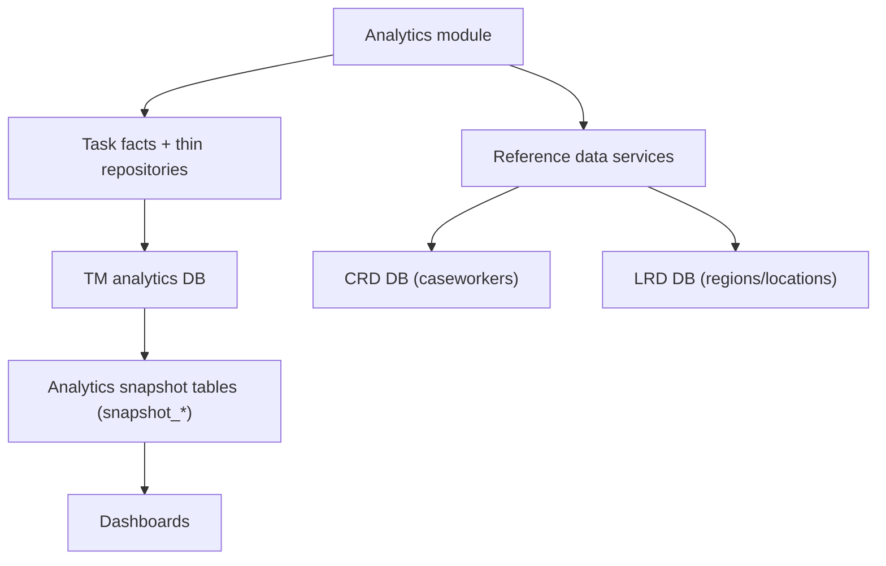

# Data sources and data model

## Databases
The application connects to three PostgreSQL databases using Prisma clients and raw SQL:

1) Task Management analytics database (tm)
- Purpose: aggregated and per-task analytics for work allocation tasks.
- Prisma client: `tmPrisma`.
- Config prefix: `database.tm`.

2) Caseworker reference database (crd)
- Purpose: caseworker profiles for user display names.
- Prisma client: `crdPrisma`.
- Config prefix: `database.crd`.

3) Location reference database (lrd)
- Purpose: region and court venue descriptions.
- Prisma client: `lrdPrisma`.
- Config prefix: `database.lrd`.

Connection building:
- Uses `database.<prefix>.url` when provided; otherwise builds from host/port/user/password/db_name/schema.
- Optional `schema` is passed via PostgreSQL `search_path` in the connection string.

## Core analytics snapshot tables (tm database)
The application relies on published snapshot tables in the `analytics` schema. Snapshot data tables are immutable and keyed by `snapshot_id`; repository queries read one selected snapshot with:

- `snapshot_id = :snapshotId`

Minimum columns required are listed below (based on query usage).

### analytics.snapshot_batches
Snapshot metadata for refresh lifecycle and publish history.

Required columns:
- snapshot_id
- status
- started_at
- completed_at

### Snapshot refresh procedure
Snapshots are built/published by `analytics.run_snapshot_refresh_batch()`.

- Each run performs a full rebuild from source data before publishing the new snapshot.

### analytics.snapshot_task_daily_facts
Used for service overview, events, timelines, completion summaries, and outstanding open-task aggregates (by name, by region/location, and summary totals).

Required columns:
- snapshot_id
- jurisdiction_label (service)
- role_category_label
- region
- location
- task_name
- work_type
- assignment_state (Assigned/Unassigned/null)
- task_status (open/completed/cancelled/other)
- date_role (created/completed/cancelled/due)
- reference_date (date)
- task_count (integer)
- priority (numeric priority)
- sla_flag (boolean)
- handling_time_days_sum
- handling_time_days_count
- processing_time_days_sum
- processing_time_days_count

### analytics.snapshot_task_rows
Used for per-task lists (user overview, critical tasks, task audit), completed-by-task-name aggregates on `/users`, and processing/handling time.

Required columns:
- snapshot_id
- case_id
- task_id
- task_name
- case_type_label
- jurisdiction_label
- role_category_label
- work_type
- region
- location
- created_date
- first_assigned_date
- due_date
- completed_date
- handling_time_days
- handling_time (interval)
- due_date_to_completed_diff_time (interval)
- processing_time_days
- processing_time (interval)
- is_within_sla (Yes/No/null)
- state (ASSIGNED/COMPLETED/TERMINATED/etc)
- termination_reason
- termination_process_label
- outcome
- major_priority (numeric)
- assignee
- number_of_reassignments
- within_due_sort_value (indexed sort rank for within-due ordering)

Note:
- Priority rank is calculated at query-time from `major_priority`, `due_date`, and `CURRENT_DATE`.
- Row-level repositories return numeric `priority_rank`; labels are mapped in TypeScript when building UI-facing models.
- Outstanding dashboard open-task aggregate sections do not read from this table in the warm path; they are facts-backed via `snapshot_task_daily_facts`.

### analytics.snapshot_user_completed_facts
Used for `/users` completed-by-date aggregated chart/table data and facts-backed completed total counting.

Required columns:
- snapshot_id
- completed_date
- task_name
- work_type
- tasks
- within_due
- beyond_due
- handling_time_sum
- handling_time_count
- days_beyond_sum
- days_beyond_count
- assignee (for user filtering)

### analytics.snapshot_wait_time_by_assigned_date
Used for wait time by assigned date.

Required columns:
- snapshot_id
- reference_date
- work_type
- assigned_task_count
- total_wait_time (interval)

Materialization rule:
- Rows are aggregated from `analytics.snapshot_task_rows` where `state = 'ASSIGNED'` and `wait_time IS NOT NULL`, grouped by slicer fields plus `first_assigned_date` (`reference_date`).

## Reference data (crd and lrd databases)

### CRD: vw_case_worker_profile
Used to map assignee IDs to names.
On `/outstanding` Critical tasks only, if an assignee ID is present and no CRD match is found, the UI displays `Judge` instead of the raw ID.

Required columns:
- case_worker_id
- first_name
- last_name
- email_id
- region_id

### LRD: region
Used for region descriptions.

Required columns:
- region_id
- description

### LRD: court_venue
Used for location descriptions.

Required columns:
- epimms_id
- site_name
- region_id

## Filter mapping to database columns
The shared filter block maps UI filters to database columns in analytics views:
- Service -> jurisdiction_label
- Role category -> role_category_label
- Region -> region
- Location -> location
- Task name -> task_name
- Work type -> work_type
- User -> assignee (only in user overview and related queries)

Work type display values:
- The filter still submits `work_type` IDs for querying.
- Dropdown labels are sourced from `cft_task_db.work_types.label` with fallback to the ID when no label is present.

Date filters:
- completedFrom/completedTo -> completed_date in snapshot_task_rows or reference_date in snapshot_task_daily_facts.
- eventsFrom/eventsTo -> reference_date in snapshot_task_daily_facts for created/completed/cancelled events.
- User Overview page applies an additional scoped exclusion: `UPPER(role_category_label) <> 'JUDICIAL'` (null-safe), and this scoped rule is not applied on `/`, `/outstanding`, or `/completed`.

## Derived concepts and calculations

### Priority rank and label mapping
Priority is calculated in SQL as a numeric rank using `major_priority` or `priority` with a due-date-aware rule against `CURRENT_DATE`:
- <= 2000 => 4
- < 5000 => 3
- == 5000 and due_date < CURRENT_DATE => 3
- == 5000 and due_date == CURRENT_DATE => 2
- else => 1

SQL compares rank numbers only. UI-facing labels are mapped in TypeScript:
- 4 => Urgent
- 3 => High
- 2 => Medium
- 1 (and fallback) => Low

### Within due date
Within due date is computed as:
- `is_within_sla == 'Yes'` if present
- Otherwise, compare completed_date <= due_date

### Completed-task determination
Completed tasks are determined by case-insensitive `termination_reason = 'completed'` across thin/facts query paths. Completed-state values such as `COMPLETED` or `TERMINATED` are not required for completed classification.

### User Overview task-name average calculations
For `/users` "Completed tasks by task name", averages are calculated from `analytics.snapshot_task_rows` interval columns (not from `snapshot_user_completed_facts` day-difference aggregates):

- Average handling time (days):
  - `SUM(COALESCE(EXTRACT(EPOCH FROM handling_time) / EXTRACT(EPOCH FROM INTERVAL '1 day'), 0)) / COUNT(*)`
- Average days beyond due date:
  - `SUM(COALESCE(EXTRACT(EPOCH FROM due_date_to_completed_diff_time) / EXTRACT(EPOCH FROM INTERVAL '1 day'), 0) * -1) / COUNT(*)`

Both formulas include rows with null intervals in the denominator (`COUNT(*)`) while treating null interval values as zero in the summed numerator.

### User Overview completed totals
For `/users` completed total, SQL sums `snapshot_user_completed_facts.tasks` within the selected filter scope:

- `SELECT COALESCE(SUM(tasks), 0)::int AS total`

This facts-backed count preserves User Overview filters (including optional assignee and completed date range filters) while avoiding row-level completed-count scans on `snapshot_task_rows`.

### Created-event determination
Created events in task daily facts are determined by `created_date IS NOT NULL` (case state does not gate inclusion). For `date_role = 'created'`, `task_status` is derived as:
- `completed` when `LOWER(termination_reason) = 'completed'`
- `open` when `state IN ('ASSIGNED', 'UNASSIGNED', 'PENDING AUTO ASSIGN', 'UNCONFIGURED')`
- `other` otherwise

For `date_role = 'created'`, `assignment_state` is:
- `Assigned` when `state = 'ASSIGNED'`
- `Unassigned` when `state IN ('UNASSIGNED', 'PENDING AUTO ASSIGN', 'UNCONFIGURED')`
- `NULL` otherwise

## Caching
NodeCache caches these datasets to reduce repeated lookups:
- Filter options
- Caseworker profiles and names
- Regions and region descriptions
- Court venues and location descriptions

Cache TTL is configurable via `analytics.cacheTtlSeconds`.
