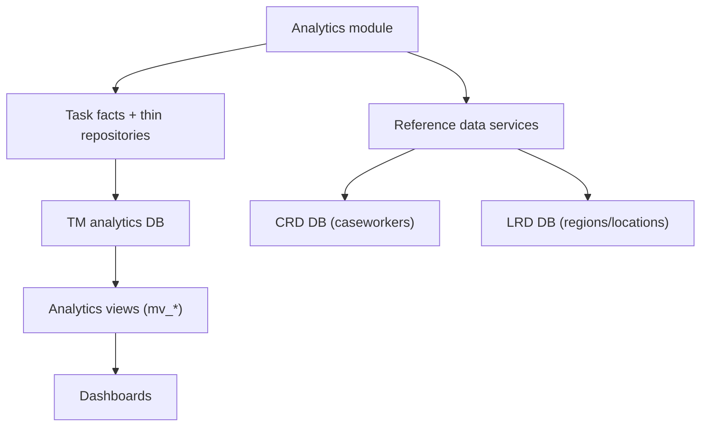

# Data sources and data model

## Databases
The application connects to three PostgreSQL databases using Prisma clients and raw SQL:

1) Task Management analytics database (tm)
- Purpose: aggregated and per-task analytics for work allocation tasks.
- Prisma client: `tmPrisma`.
- Config prefix: `database.tm`.

2) Caseworker reference database (crd)
- Purpose: caseworker profiles for user display names.
- Prisma client: `crdPrisma`.
- Config prefix: `database.crd`.

3) Location reference database (lrd)
- Purpose: region and court venue descriptions.
- Prisma client: `lrdPrisma`.
- Config prefix: `database.lrd`.

Connection building:
- Uses `database.<prefix>.url` when provided; otherwise builds from host/port/user/password/db_name/schema.
- Optional `schema` is passed via PostgreSQL `search_path` in the connection string.

## Core analytics views (tm database)
The application relies on materialized or analytics views in the `analytics` schema. Minimum columns required are listed below (based on query usage).

### analytics.mv_task_daily_facts
Used for service overview, events, timelines, and completion summaries.

Required columns:
- jurisdiction_label (service)
- role_category_label
- region
- location
- task_name
- work_type
- assignment_state (Assigned/Unassigned)
- task_status (open/completed)
- date_role (created/completed/cancelled/due)
- reference_date (date)
- task_count (integer)
- priority (numeric priority)
- sla_flag (boolean)
- handling_time_days_sum
- handling_time_days_count
- processing_time_days_sum
- processing_time_days_count

### analytics.mv_reportable_task_thin
Used for per-task lists (user overview, critical tasks, task audit) and processing/handling time.

Required columns:
- case_id
- task_id
- task_name
- case_type_label
- jurisdiction_label
- role_category_label
- work_type
- region
- location
- created_date
- first_assigned_date
- due_date
- completed_date
- handling_time_days
- processing_time_days
- is_within_sla (Yes/No/null)
- state (ASSIGNED/COMPLETED/TERMINATED/etc)
- termination_reason
- termination_process_label
- major_priority (numeric)
- assignee
- number_of_reassignments

### analytics.mv_user_completed_facts
Used for user overview aggregated charts.

Required columns:
- completed_date
- task_name
- work_type
- tasks
- within_due
- beyond_due
- handling_time_sum
- handling_time_count
- days_beyond_sum
- days_beyond_count
- assignee (for user filtering)

### analytics.mv_open_tasks_by_name
Used for open tasks by name and priority.

Required columns:
- task_name
- work_type
- priority_bucket (Urgent/High/Medium/Low)
- task_count

### analytics.mv_open_tasks_by_region_location
Used for outstanding by region/location tables.

Required columns:
- region
- location
- work_type
- priority_bucket (Urgent/High/Medium/Low)
- task_count

### analytics.mv_open_tasks_summary
Used for open tasks summary counts.

Required columns:
- state (ASSIGNED or not)
- work_type
- priority_bucket
- task_count

### analytics.mv_open_tasks_wait_time_by_assigned_date
Used for wait time by assigned date.

Required columns:
- reference_date
- work_type
- assigned_task_count
- total_wait_time_days

## Reference data (crd and lrd databases)

### CRD: vw_case_worker_profile
Used to map assignee IDs to names.

Required columns:
- case_worker_id
- first_name
- last_name
- email_id
- region_id

### LRD: region
Used for region descriptions.

Required columns:
- region_id
- description

### LRD: court_venue
Used for location descriptions.

Required columns:
- epimms_id
- site_name
- region_id

## Filter mapping to database columns
The shared filter block maps UI filters to database columns in analytics views:
- Service -> jurisdiction_label
- Role category -> role_category_label
- Region -> region
- Location -> location
- Task name -> task_name
- Work type -> work_type
- User -> assignee (only in user overview and related queries)

Work type display values:
- The filter still submits `work_type` IDs for querying.
- Dropdown labels are sourced from `cft_task_db.work_types.label` with fallback to the ID when no label is present.

Date filters:
- completedFrom/completedTo -> completed_date in mv_reportable_task_thin or reference_date in mv_task_daily_facts.
- eventsFrom/eventsTo -> reference_date in mv_task_daily_facts for created/completed/cancelled events.

## Derived concepts and calculations

### Priority bucket
Priority is calculated using `major_priority` or `priority` with a due-date-aware rule:
- <= 2000 => urgent
- < 5000 => high
- == 5000 and due_date < today => high
- == 5000 and due_date == today => medium
- else => low

### Within due date
Within due date is computed as:
- `is_within_sla == 'Yes'` if present
- Otherwise, compare completed_date <= due_date

## Caching
NodeCache caches these datasets to reduce repeated lookups:
- Filter options
- Caseworker profiles and names
- Regions and region descriptions
- Court venues and location descriptions

Cache TTL is configurable via `analytics.cacheTtlSeconds`.
