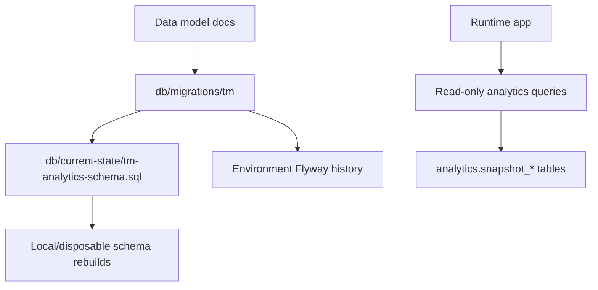

# Data sources and data model

This is the entry point for the analytics data model documentation. Detailed contracts are split by purpose so readers and agents can find the right rule without scanning the full table catalogue.

## Read first

- [Data sources overview](data-sources/README.md): databases, source systems, and the snapshot read model.
- [Snapshot lifecycle](data-sources/snapshot-lifecycle.md): refresh, publish, retention, metadata, and pg_cron relationship.
- [Snapshot table catalogue](data-sources/snapshot-tables.md): row, facts, rollup, and facet table contracts.
- [Repository ownership](data-sources/repository-ownership.md): one-table-per-repository ownership rules and coordinator exceptions.
- [Filter facets and mappings](data-sources/filter-facets.md): page-scoped facet sources, filter-to-column mappings, and scoped exclusions.
- [Derived metrics](data-sources/derived-metrics.md): priority, SLA, completion, cancellation, and averages.
- [Reference data](data-sources/reference-data.md): CRD/LRD reference data joins and fallback display rules.

## Source-of-truth relationship

The current schema shape is produced by repository-owned Flyway migrations under `db/migrations/tm/`.

`db/current-state/tm-analytics-schema.sql` is the rerunnable current-state mirror of that Flyway end state for local and disposable rebuild workflows. It is maintained alongside the migrations but is not migration history.

The application reads analytics tables only. It does not apply Flyway migrations at startup.

```mermaid
flowchart TB
  Docs["Data model docs"] --> Migrations["db/migrations/tm"]
  Migrations --> CurrentState["db/current-state/tm-analytics-schema.sql"]
  CurrentState --> LocalRebuild["Local/disposable schema rebuilds"]
  Migrations --> Environments["Environment Flyway history"]
  App["Runtime app"] --> Reads["Read-only analytics queries"]
  Reads --> Snapshots["analytics.snapshot_* tables"]
```
