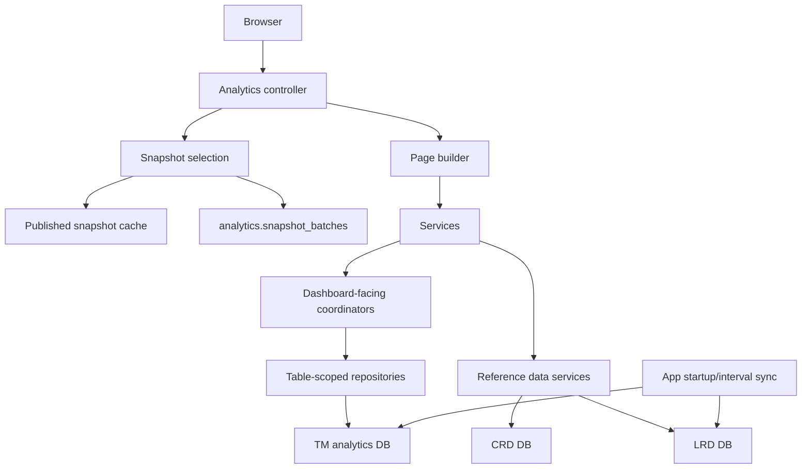

# Data sources overview

The application connects to three PostgreSQL databases using Prisma clients and raw SQL.

| Database | Purpose | Prisma client | Config prefix |
| --- | --- | --- | --- |
| Task Management analytics database (`tm`) | Snapshot-backed analytics for work allocation tasks | `tmPrisma` | `database.tm` |
| Caseworker reference database (`crd`) | Caseworker profiles for user display names | `crdPrisma` | `database.crd` |
| Location reference database (`lrd`) | Region descriptions and source court venue data copied into analytics-owned location lookup tables | `lrdPrisma` | `database.lrd` |

Connection building:

- Uses `database.<prefix>.url` when provided.
- Otherwise builds from host, port, username, password, database name, and optional schema.
- Optional `schema` is passed through PostgreSQL `search_path` in the connection string.
- Prisma clients are created with `PrismaPg({ connectionString })`.

## Runtime read model

All analytics reads are snapshot-scoped by `snapshot_id = :snapshotId`. Published snapshots are immutable and the app reads one selected snapshot at a time.

The app keeps a separate in-process NodeCache entry for current published snapshot metadata using `analytics.publishedSnapshotCacheTtlSeconds`. That fast path is used only when a request has no `snapshotToken` or when the signed `snapshotToken` matches the cached current published snapshot id. Requests for older snapshot ids still validate against `analytics.snapshot_batches` so retention cleanup cannot leave a stale historical snapshot marked as valid.

## Source systems

The snapshot refresh procedure rebuilds analytics tables from upstream TM source tables, primarily `cft_task_db.reportable_task`. Work type display labels are resolved from `cft_task_db.work_types`.

Upstream dependencies remain external:

- Flyway does not create `cft_task_db.reportable_task`.
- Flyway does not create `cft_task_db.work_types`.
- The analytics migration chain is not a full bootstrap for an otherwise blank PostgreSQL database.

## Performance notes

No separate benchmark or performance-review technical document is currently checked into this repository. Treat these docs, the Flyway migrations under `db/migrations/tm/`, and the current-state SQL under `db/current-state/tm-analytics-schema.sql` as the checked-in source of truth for the implemented analytics data model.
