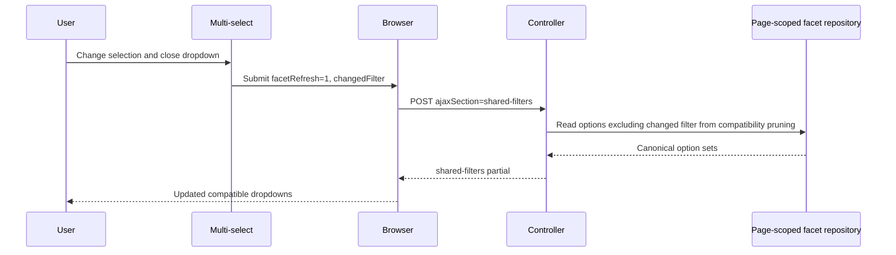

# Filter facets and mappings

Shared filter options are materialised into page-scoped facet tables so dropdowns reflect the workload each page actually uses.

## Page-scoped facet tables

Common columns:

- `snapshot_id`
- `jurisdiction_label`
- `role_category_label`
- `region`
- `location`
- `task_name`
- `work_type`
- `row_count`

User-only extra column:

- `assignee` on `analytics.snapshot_user_filter_facts`

| Facet table | Page | Population rule |
| --- | --- | --- |
| `analytics.snapshot_overview_filter_facts` | `/` | Aggregated from the union of `snapshot_open_due_daily_facts` and `snapshot_task_event_daily_facts` |
| `analytics.snapshot_outstanding_filter_facts` | `/outstanding` | Aggregated from `snapshot_open_task_rows` |
| `analytics.snapshot_completed_filter_facts` | `/completed` | Aggregated from `snapshot_completed_task_rows` |
| `analytics.snapshot_user_filter_facts` | `/users` | Aggregated from assigned rows in `snapshot_open_task_rows` plus all `snapshot_completed_task_rows`; applies User Overview Judicial exclusion during materialisation |

Notes for all facet tables:

- Blank strings are normalised to `NULL` at materialisation time.
- Work type display labels are resolved at read time by joining `cft_task_db.work_types`.
- User Overview still applies its query-time Judicial exclusion when reading row and fact queries.
- Unfiltered non-user scopes (`/`, `/outstanding`, and `/completed`) read filter options with one `GROUPING SETS` query per page-scoped facet table.
- Filtered states use per-facet queries so each dropdown can exclude its own active filter while respecting the others.

## Filter mapping

Shared filters:

| UI filter | SQL column |
| --- | --- |
| Service | `jurisdiction_label` |
| Role category | `role_category_label` |
| Region | `region` |
| Location | `location` |
| Task name | `task_name` |
| Work type | `work_type` |
| User | `assignee` on User overview only |

Date filters:

| UI filter | SQL mapping |
| --- | --- |
| `completedFrom` / `completedTo` | `completed_date` in completed row/user-completed facts, or `reference_date` in completed dashboard facts |
| `eventsFrom` / `eventsTo` | `reference_date` or `event_date` in task-event facts depending on table |

Scoped exclusions:

- User Overview applies `UPPER(role_category_label) <> 'JUDICIAL'` with null-safe semantics.
- The Judicial exclusion does not apply on `/`, `/outstanding`, or `/completed`.

## Facet refresh flow

