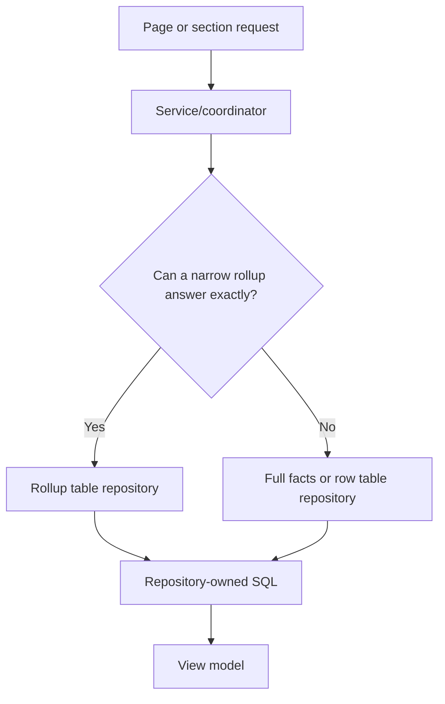

# Repository ownership

Analytics repository files are table-scoped. Each repository file owns reads from exactly one physical table or view. Runtime decisions about which table to use belong in page/service/coordinator layers.

Shared helpers such as `filterFactsQueryHelpers.ts`, `rowRepositoryHelpers.ts`, and `snapshotMetadataHelpers.ts` may build SQL fragments for multiple repositories, but they do not own table reads themselves.

Dashboard-facing coordinators such as `snapshotCompletedDashboardRepository.ts`, `snapshotUserCompletedRepository.ts`, and `snapshotTaskEventsRepository.ts` choose between table-specific repositories for safe fast paths and full-facts fallbacks. They do not contain table SQL.

## Ownership map

| Table or view | Owning repository |
| --- | --- |
| `analytics.snapshot_open_due_daily_facts` | `src/main/modules/analytics/shared/repositories/snapshotOpenDueDailyFactsRepository.ts` |
| `analytics.snapshot_task_event_daily_facts` | `src/main/modules/analytics/shared/repositories/snapshotTaskEventDailyFactsRepository.ts` |
| `analytics.snapshot_task_event_service_daily_facts` | `src/main/modules/analytics/shared/repositories/snapshotTaskEventServiceDailyFactsRepository.ts` |
| `analytics.snapshot_outstanding_created_assignment_daily_facts` | `src/main/modules/analytics/shared/repositories/snapshotOutstandingCreatedAssignmentDailyFactsRepository.ts` |
| `analytics.snapshot_outstanding_due_status_daily_facts` | `src/main/modules/analytics/shared/repositories/snapshotOutstandingDueStatusDailyFactsRepository.ts` |
| `analytics.snapshot_completed_dashboard_facts` | `src/main/modules/analytics/shared/repositories/snapshotCompletedDashboardFactsRepository.ts` |
| `analytics.snapshot_completed_daily_metrics_facts` | `src/main/modules/analytics/shared/repositories/snapshotCompletedDailyMetricsFactsRepository.ts` |
| `analytics.snapshot_completed_region_location_facts` | `src/main/modules/analytics/shared/repositories/snapshotCompletedRegionLocationFactsRepository.ts` |
| `analytics.snapshot_open_task_rows` | `src/main/modules/analytics/shared/repositories/snapshotOpenTaskRowsRepository.ts` |
| `analytics.snapshot_completed_task_rows` | `src/main/modules/analytics/shared/repositories/snapshotCompletedTaskRowsRepository.ts` |
| `analytics.snapshot_user_completed_facts` | `src/main/modules/analytics/shared/repositories/snapshotUserCompletedFactsRepository.ts` |
| `analytics.snapshot_user_completed_daily_totals` | `src/main/modules/analytics/shared/repositories/snapshotUserCompletedDailyTotalsRepository.ts` |
| `analytics.snapshot_user_completed_slicer_daily_facts` | `src/main/modules/analytics/shared/repositories/snapshotUserCompletedSlicerDailyFactsRepository.ts` |
| `analytics.snapshot_wait_time_by_assigned_date` | `src/main/modules/analytics/shared/repositories/snapshotWaitTimeByAssignedDateRepository.ts` |
| `analytics.snapshot_overview_filter_facts` | `src/main/modules/analytics/shared/repositories/snapshotOverviewFilterFactsRepository.ts` |
| `analytics.snapshot_outstanding_filter_facts` | `src/main/modules/analytics/shared/repositories/snapshotOutstandingFilterFactsRepository.ts` |
| `analytics.snapshot_completed_filter_facts` | `src/main/modules/analytics/shared/repositories/snapshotCompletedFilterFactsRepository.ts` |
| `analytics.snapshot_user_filter_facts` | `src/main/modules/analytics/shared/repositories/snapshotUserFilterFactsRepository.ts` |
| `analytics.snapshot_state` | `src/main/modules/analytics/shared/repositories/snapshotStateRepository.ts` |
| `analytics.snapshot_batches` | `src/main/modules/analytics/shared/repositories/snapshotBatchesRepository.ts` |

## Data-source routing pattern

Use a rollup only when the omitted dimensions cannot affect the requested result. If a user-selected filter targets a dimension missing from the rollup, route to the full facts or row-backed repository.
