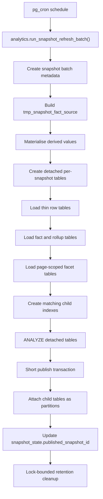
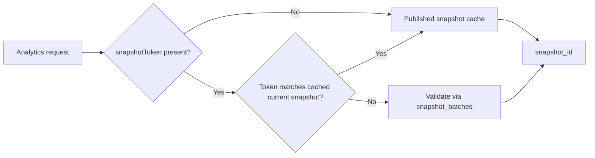

# Snapshot lifecycle

Snapshots are built and published by `analytics.run_snapshot_refresh_batch()`. The runtime application reads published snapshot data and does not run schema migrations or refresh jobs itself.

## Metadata tables

### `analytics.snapshot_batches`

Snapshot lifecycle metadata.

Required columns:

- `snapshot_id`
- `status`
- `started_at`
- `completed_at`
- `error_message`

### `analytics.snapshot_state`

Single-row publish pointer.

Required columns:

- `published_snapshot_id`
- `published_at`
- `in_progress_snapshot_id`

## Refresh and publish flow

Current refresh shape:

- Full rebuild from `cft_task_db.reportable_task`.
- `analytics.run_snapshot_refresh_batch()` coordinates internal helpers for temp-table staging, detached partition creation, detached data population, core index creation, filter-fact materialisation, and filter-index creation.
- Creates a narrow temp staging table with only the columns and derived values needed by the app.
- Builds detached per-snapshot tables for every snapshot parent before publish.
- Loads thin row tables first, then facts, then page-scoped facet tables.
- Populates page-scoped aggregate facts directly from `tmp_snapshot_fact_source` where possible.
- Creates child indexes on detached aggregate partitions with definitions that match parent partitioned indexes, so publish can attach or reuse them without leaving duplicate per-snapshot index families.
- Runs `ANALYZE` on every detached snapshot table before publish.
- Commits detached build tables before publish.
- Opens a short publish transaction that attaches those tables as partitions and updates `analytics.snapshot_state`.
- Keeps the previous published snapshot readable during detached build because live parent tables are not modified until final attach.

Refresh-time derived values materialised in staging:

- `wait_time_days`
- `handling_time_days`
- `processing_time_days`
- `days_beyond_due`
- `within_due_sort_value`
- `termination_reason_lower`

Refresh-time session settings:

- Baseline refresh work: `work_mem = 256MB`, `maintenance_work_mem = 1GB`
- Aggregate fact builds: `work_mem = 1GB`, `hash_mem_multiplier = 4`, `enable_sort = off`
- Facet aggregation: `work_mem = 1GB`, `hash_mem_multiplier = 4`, `enable_sort = off`

## Retention

Retention keeps:

- The published snapshot
- Any in-progress snapshot
- The latest 3 succeeded snapshots
- Up to 100 failed batch records

Obsolete snapshots are cleaned up after publish by detaching their child tables from live parents in a short lock-bounded step, then dropping the detached tables. If cleanup cannot get the required parent lock quickly, it logs a warning and leaves that obsolete snapshot for a later run.

## Runtime snapshot selection

Runtime reads use a selected snapshot id for every analytics query. The current published snapshot uses a short TTL cache for fast routing; historical snapshot ids are validated against `analytics.snapshot_batches`.

