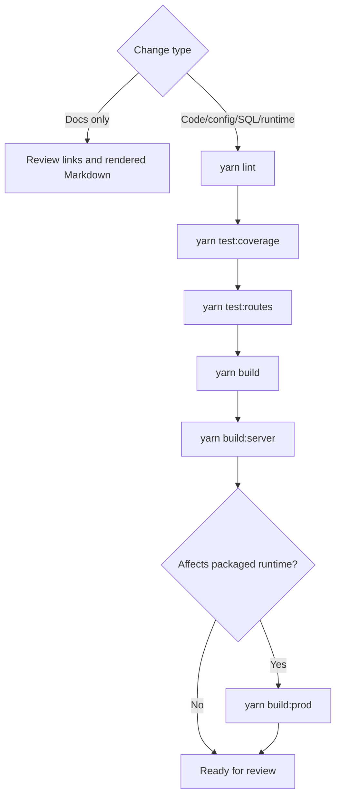

# Deployment and CI

## Current command semantics

- `yarn test:unit` is the direct Jest unit-test suite.
- `yarn test` is a repository wrapper. Outside CI it delegates to `yarn test:unit`; when `CI=true` it exits early instead of running Jest.
- `yarn build` is the frontend webpack build only.
- `yarn build:server` is the server TypeScript compile.
- `yarn build:prod` builds production frontend assets and copies static/views into `dist/main`.

## Repository `cichecks`

`package.json` `cichecks` currently runs:

- `yarn install`
- `yarn build`
- `yarn rebuild puppeteer`
- `yarn lint`
- `yarn test`
- `yarn test:routes`
- `yarn test:a11y`

Because `yarn test` exits early when `CI=true`, `cichecks` is not equivalent to the full local merge-readiness command set described in [Testing and quality](testing.md).

## Jenkins

The checked-in Jenkins pipeline currently runs:

- `playwright install`
- `rebuild puppeteer`
- `build` in the build stage
- `test:routes` in a later post-test step

Neither `cichecks` nor the checked-in Jenkins build stage currently runs `yarn build:server`.

Flyway is wired in Jenkins as an explicit post-`buildinfra` action for `aat`, `demo`, `ithc`, `perftest`, and `prod`. See [Flyway runbook](operations/flyway.md).

Demo and Prod stages invoke the TM schema permissions bootstrap directly after Flyway. See [Schema permissions runbook](operations/schema-permissions.md).

## Local merge-readiness expectation

For non-documentation changes, contributor guidance expects:

- `yarn lint`
- `yarn test:coverage`
- `yarn test:routes`
- `yarn build`
- `yarn build:server`

Run `yarn build:prod` as well when the change affects packaged runtime output or `yarn start`.

Documentation-only changes do not require those commands.

