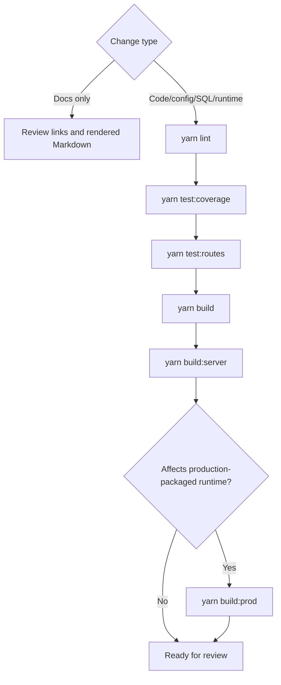

# Deployment and CI

## Current command semantics

- `yarn test:unit` is the direct Jest unit-test suite.
- `yarn test` is a repository wrapper. Outside CI it delegates to `yarn test:unit`; when `CI=true` it exits early instead of running Jest.
- `yarn build` is the frontend webpack build only.
- `yarn build:server` is the TypeScript 7 server compile.
- `yarn build:prod` builds production frontend assets and copies static/views into `dist/main`.

## Repository `cichecks`

`package.json` `cichecks` currently runs:

- `yarn install`
- `yarn build`
- `yarn rebuild puppeteer`
- `yarn lint`
- `yarn test`
- `yarn test:routes`
- `yarn test:a11y`

Because `yarn test` exits early when `CI=true`, `cichecks` is not equivalent to the local merge-readiness command set described in [Testing and quality](testing.md) and required by the root [AGENTS.md](../../AGENTS.md). That local standard may exceed checks enforced by the currently checked-in CI configuration.

## Jenkins

The checked-in Jenkins pipeline currently runs:

- `rebuild puppeteer`
- `build` in the build stage
- `test:routes` in a later post-test step

The `test:a11y`, `test:smoke`, and `test:functional` package scripts install Playwright's default browsers immediately before running their tests. Browser availability therefore does not depend on the build stage running first.

The TypeScript 7 compiler is installed as `@typescript/native` and invoked by `tsc` and `build:server`. API-dependent tools continue to resolve TypeScript 6 through the top-level `typescript` alias. Neither `cichecks` nor the checked-in Jenkins build stage currently runs `yarn build:server`.

Flyway is wired in Jenkins as an explicit post-`buildinfra` action for `aat`, `demo`, `ithc`, `perftest`, and `prod`. See [Flyway runbook](operations/flyway.md).

The Prod stage invokes the TM schema permissions bootstrap directly after Flyway. See [Schema permissions runbook](operations/schema-permissions.md).

## Local merge-readiness expectation

For non-documentation changes, contributor guidance defines the local merge-readiness standard as:

- `yarn lint`
- `yarn test:coverage`
- `yarn test:routes`
- `yarn build`
- `yarn build:server`

Run `yarn build:prod` as well when the change affects production-packaged runtime output or production startup.

Documentation-only changes do not require those commands.

```mermaid
flowchart TB
  Change{"Change type"}
  Change -- "Docs only" --> DocsReview["Review links and rendered Markdown"]
  Change -- "Code/config/SQL/runtime" --> Lint["yarn lint"]
  Lint --> Coverage["yarn test:coverage"]
  Coverage --> Routes["yarn test:routes"]
  Routes --> FrontendBuild["yarn build"]
  FrontendBuild --> ServerBuild["yarn build:server"]
  ServerBuild --> Prod{"Affects production-packaged runtime?"}
  Prod -- "Yes" --> BuildProd["yarn build:prod"]
  Prod -- "No" --> Done["Ready for review"]
  BuildProd --> Done
```
