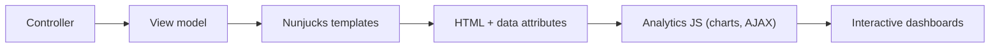
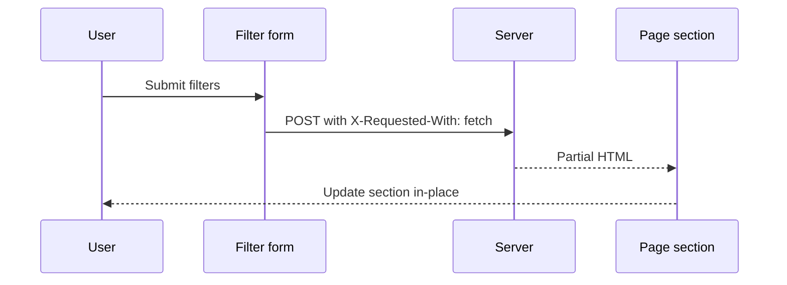

# Frontend specification

## Templating and layout
- Nunjucks is the server-side templating engine.
- Base layout: `src/main/views/layouts/main.njk` extends `govuk/template.njk`.
- Analytics layout: `src/main/views/analytics/layout.njk` adds GOV.UK header + service navigation and defines the page content block.
- Assets are included through `src/main/views/webpack/css.njk` and `src/main/views/webpack/js.njk`.

## Global Nunjucks helpers
The Nunjucks environment adds:
- Global: `manageCaseBaseUrl` (for case links)
- Filters: `formatNumber`, `extractNumericColumns`, `decorateNumericRows`

## Date display standard
- Analytics UI dates are displayed as `D Mon YYYY` (for example, `3 Mar 2020`).
- Source date values remain ISO `YYYY-MM-DD` for sorting and CSV export.
- Client-side sortable date cells keep ISO values in `data-sort-value`.
- CSV export prefers cell `data-export-value` so visible formatted dates can export as ISO.

## Key UI patterns
- GOV.UK Design System components (header, service navigation, tabs, tables, summary list, buttons, inputs).
- MOJ date picker for date inputs.
- Custom analytics multi-select component for filters.

### Analytics table macro
`macros/analytics-table.njk` wraps the GOV.UK table and:
- Detects numeric columns from header metadata.
- Adds numeric formatting and bold totals row styling.
- Supports sticky headers and sticky totals row.

### CSV export
`macros/csv-download.njk` adds a button which the JS layer uses to download the current table as CSV.

### Case links
`macros/case-link.njk` builds a link to Manage Case using `manageCaseBaseUrl` and opens in a new tab.

## JavaScript behaviors
Entry points:
- `src/main/assets/js/index.ts` (global GOV.UK/MOJ init)
- `src/main/assets/js/analytics.ts` (analytics-specific behaviors)

Script loading:
- `src/main/views/webpack/js.njk` loads the global `main` bundle on all pages.
- `src/main/views/webpack/analytics-js.njk` loads the `analytics` bundle.
- `src/main/views/analytics/layout.njk` includes `webpack/analytics-js.njk` so the analytics bundle is loaded only for analytics routes.

Key behaviors:
- Plotly charts are rendered from JSON configs in `data-chart-config` attributes.
- Sections marked with `data-ajax-initial` are refreshed by an AJAX call after initial page load.
- Filter forms with `data-ajax-section` can refresh a single page section without a full reload.
- Server-side sorting uses hidden inputs and submits a filtered form to fetch sorted data.
- Pagination uses hidden inputs and submits filtered form to fetch the next page.
- Multi-select filters support search, select all, and dynamic summary text.
- Scroll position is stored and restored when table sorting or pagination triggers full page reloads.
- Global page initialization is owned by `index.ts`; analytics AJAX refreshes re-initialize only the replaced section scope in `src/main/assets/js/analytics/ajax.ts`.

## Charts
- Plotly is bundled and assigned to `window.Plotly` for use by chart components.
- Base config:
  - Responsive layout
  - Modebar without lasso/select/auto-scale
  - Autosized axes with compact margins
- Chart types:
  - Donut charts (priority and compliance)
  - Stacked bar time series
  - Stacked horizontal bar charts
  - Line charts with optional standard deviation bands
- A custom scroll/pan UI is used for large category lists (open tasks by name).

## Styling (SCSS)
- GOV.UK and MOJ frontends are imported and configured.
- Page width is set to 1400px.
- CSS variables define chart colors aligned with GOV.UK palette.
- Shared chart colours are defined in `src/main/modules/analytics/shared/charts/colors.ts` using named colour keys (for example `purple`, `blueDark`, `blueLight`, `greyLight`, `blue`, `grey`, `green`).
- Priority bucket charts explicitly map Urgent/High/Medium/Low to `purple`/`blueDark`/`blueLight`/`greyLight`; non-priority chart semantics reuse the same blue/grey/green palette family.
- Custom styles for:
  - Analytics charts and small charts
  - Multi-select dropdown and search
  - Tab panel sizing and pagination bar
  - Sticky headers and sticky totals rows
