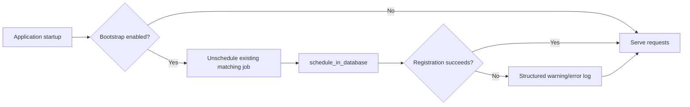

# Snapshot refresh runbook

This runbook covers startup registration of the analytics snapshot refresh schedule and runtime notes for the refresh procedure. The data model details live in [Snapshot lifecycle](../data-sources/snapshot-lifecycle.md).

## Location reference sync

App startup runs `bootstrapLocationReferenceSync()` before pg_cron registration. The sync reads LRD through `lrdPrisma` and refreshes analytics-owned lookup tables through `tmPrisma`.

Synced tables:

- `analytics.court_venue_case_type_lookup`
- `analytics.court_venue_epimms_lookup`
- `analytics.location_reference_sync_state`

Operational behaviour:

- The sync is enabled by default through `analytics.locationReferenceSync.enabled`.
- The periodic interval defaults to 900 seconds through `analytics.locationReferenceSync.intervalSeconds`.
- A TM transaction-level advisory lock prevents concurrent sync writes from multiple app instances.
- Startup and periodic sync failures are logged but do not stop the app from serving requests.
- Snapshot refresh uses the last successful analytics lookup state; it does not perform cross-database joins to LRD.
- Local database seed/refresh commands run the same analytics lookup population before `CALL analytics.run_snapshot_refresh_batch()`.

## Startup cron bootstrap

When `analytics.snapshotRefreshCronBootstrap.enabled=true`, app startup attempts to register the snapshot refresh schedule through `cron.schedule_in_database(...)`.

Registration behaviour:

- Uses TM connection credentials and host settings.
- Overrides the database name to `analytics.snapshotRefreshCronBootstrap.cronDatabase`, which defaults to `postgres`.
- Is non-fatal: startup logs failures and continues serving requests.
- Is idempotent: existing jobs matching `jobName` and `targetDatabase` are unscheduled before registering the configured definition.
- Does not initialize or advance Flyway schema history.

Failure logs include structured error fields:

- `errorName`
- `errorMessage`
- Optional `errorCode`
- Optional `errorDetail`
- Optional `errorHint`
- Optional `errorMeta`
- `errorStack`

## Prerequisites

- `pg_cron` extension and `cron` schema/functions are available in `cronDatabase`.
- The application DB role can read from `cron.job`.
- The application DB role can execute `cron.unschedule(...)`.
- The application DB role can execute `cron.schedule_in_database(...)`.

## Runtime refresh notes

- `analytics.run_snapshot_refresh_batch()` builds detached snapshot tables first.
- `tmp_snapshot_source.location_id` preserves the raw `reportable_task.location` EPIMMS ID.
- `tmp_snapshot_source.location` is the resolved display label: `(location_id, case_type_id)` lookup first, unambiguous EPIMMS lookup second, raw EPIMMS ID last.
- Parent-table metadata locks are taken only during the short final attach/publish step.
- Refresh-created aggregate partition indexes match corresponding parent partitioned indexes.
- Matching index definitions let Postgres attach/reuse those indexes at publish time instead of maintaining duplicate child-local index families.
- Post-publish retention cleanup uses a short `lock_timeout` while detaching obsolete partitions.
- If retention cleanup cannot obtain the lock quickly, it logs a warning and leaves the old snapshot for a later run.

