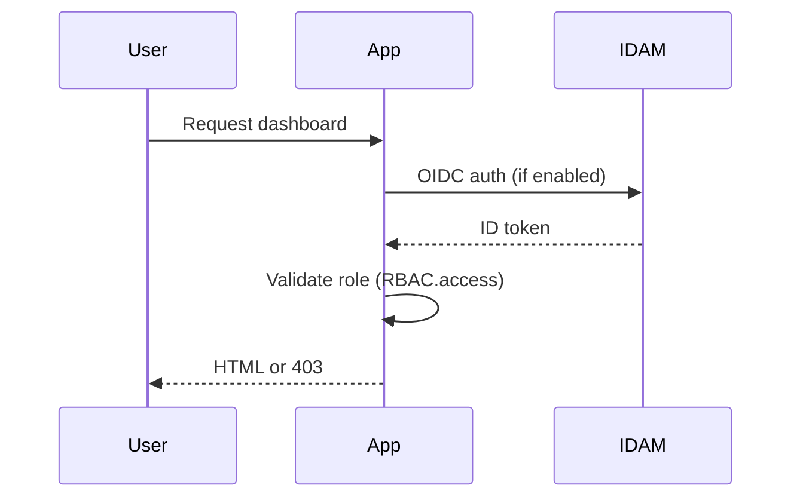

# Security and authentication

## Authentication and RBAC
- Authentication is handled by `express-openid-connect` when `auth.enabled` is true.
- OIDC issuer: `services.idam.url.public + '/o'`.
- The app validates the `id_token` and enforces a required role (`RBAC.access`, default `caseworker`).
- Requests from unauthenticated users or users without the required role return HTTP 403.

## Sessions
Two session mechanisms are used:
1) Application session (`AppSession`):
   - Cookie name: `session.appCookie.name`
   - HTTP-only, SameSite=Lax
   - Store: Redis if configured, otherwise file store in `/tmp`.

2) OIDC session (express-openid-connect):
   - Cookie name: `session.cookie.name`
   - Rolling sessions with 20-minute duration
   - Store: Redis if configured, otherwise file store in `/tmp`.

## CSRF protection
- Enabled by default via `useCSRFProtection`.
- Uses `csrf-sync` with synchronised tokens stored in the session.
- Token is expected in `_csrf` form fields or `x-csrf-token` header.
- A CSRF token is added to `res.locals.csrfToken` for all analytics routes.

## Security headers (Helmet)
- Helmet is enabled with a strict Content Security Policy.
- Allowed sources:
  - `default-src 'none'`
  - `script-src 'self'` plus Google Analytics and hash allowlist
  - `style-src 'self' 'unsafe-inline'`
  - `img-src 'self'` + data/blob + Google Analytics
- In development, `unsafe-eval` is added to allow webpack dev tooling.
- Referrer policy is configured (default `origin`).

## Cookies and filter persistence
- Analytics filters are stored in a signed cookie:
  - Name: `analytics.filtersCookieName` (default `wa-reporting-analytics-filters`).
  - Path: `/`.
  - Max age: `analytics.filtersCookieMaxAgeDays`.
- The cookie is cleared on filter reset or when the filter payload exceeds size limits.

## Pagination query safeguards
- Server-side pagination is capped to `MAX_PAGINATION_RESULTS` (5,000 rows) for paged analytics tables.
- Requested page numbers are clamped to the last page inside that 5,000-row window before database queries run.
- SQL pagination clauses also enforce the same cap, which prevents authenticated users from forcing large `OFFSET` scans outside the supported window.
