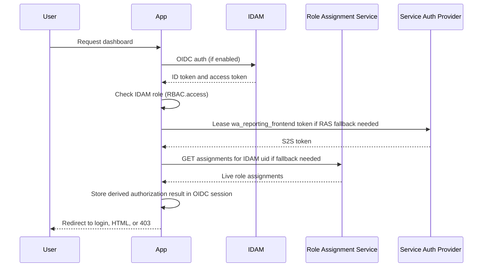

# Security and authentication

## Authentication and RBAC
- Authentication is handled by `express-openid-connect` when `auth.enabled` is true.
- OIDC issuer: `services.idam.url.public + '/o'`.
- The app validates the `id_token` and authorises access when the user has either the configured IDAM role from `RBAC.access` or an active Role Assignment Service assignment whose `roleName` is listed in `RBAC.roleAssignmentRoleNames`.
- The checked-in default role in `config/default.json` is `wa-reports-viewer`.
- The checked-in default role-assignment role name is `task-supervisor`.
- With authentication enabled, unauthenticated HTML requests are redirected to login by `express-openid-connect` before the local role guard runs.
- Role assignments are checked only during the OIDC login callback. The app calls `GET /am/role-assignments/actors/{uid}` with the logged-in user's IDAM access token and a `wa_reporting_frontend` S2S token, then stores only the derived authorization result in the OIDC session.
- A role assignment grants access only when its `roleName` exactly matches one configured role name and the current login time is within its `beginTime`/`endTime` window. Null `beginTime` or `endTime` means no lower or upper bound.
- After the OIDC middleware has run, the local guard throws HTTP 403 when `req.oidc` is still unauthenticated or when the authenticated user has neither the IDAM role nor the stored role-assignment authorization marker.
- Local development can run with `AUTH_ENABLED=false`, which disables OIDC entirely.

```mermaid
sequenceDiagram
  participant User as User
  participant App as App
  participant IDAM as IDAM
  participant RAS as Role Assignment Service
  participant S2S as Service Auth Provider
  User->>App: Request dashboard
  App->>IDAM: OIDC auth (if enabled)
  IDAM-->>App: ID token and access token
  App->>App: Check IDAM role (RBAC.access)
  App->>S2S: Lease wa_reporting_frontend token if RAS fallback needed
  S2S-->>App: S2S token
  App->>RAS: GET assignments for IDAM uid if fallback needed
  RAS-->>App: Live role assignments
  App->>App: Store derived authorization result in OIDC session
  App-->>User: Redirect to login, HTML, or 403
```

## Sessions
Two session mechanisms are used:

1) Application session (`AppSession`):
   - Cookie name: `session.appCookie.name`
   - Current cookie attributes: `httpOnly: true`, `sameSite: 'lax'`
   - `secure` is not currently set by the session module
   - Store: Redis if configured, otherwise file store in `/tmp`

2) OIDC session (`express-openid-connect`):
   - Cookie name: `session.cookie.name`
   - Rolling session with 60-minute duration
   - Current cookie attributes: `httpOnly: true`
   - `sameSite` and `secure` are not currently set by the OIDC wrapper
   - Store: Redis if configured, otherwise file store in `/tmp`

## CSRF protection
- Enabled by default via `useCSRFProtection`.
- Uses `csrf-sync` with synchronised tokens stored in the session.
- Token is expected in `_csrf` form fields or `x-csrf-token` header.
- A CSRF token is added to `res.locals.csrfToken` for all analytics routes.

## Request body parsing
- URL-encoded request bodies are parsed by Express/body-parser using app configuration:
  - `requestBody.urlencodedLimit`
  - `requestBody.urlencodedParameterLimit`
- Requests that exceed either configured limit are rejected before route handlers run.

## Security headers (Helmet)
- The current Helmet wrapper lives in `src/main/modules/helmet/index.ts`.
- The current Content Security Policy allows:
  - `default-src 'none'`
  - `script-src 'self'` plus Google Analytics and a hash allowlist
  - `style-src 'self' 'unsafe-inline'`
  - `img-src 'self'` plus `data:`, `blob:`, and Google Analytics
  - `font-src 'self' data:`
  - `connect-src 'self'`
- In development, `'unsafe-eval'` is added to `script-src` for webpack tooling. It is omitted outside development.
- The current wrapper hard-codes `referrerPolicy: origin`.
- HSTS uses Helmet's default strict-transport-security configuration because this application does not currently expose HSTS tuning through app config.

## Cookies and filter persistence
- Analytics filters are stored in a signed cookie:
  - Name: `analytics.filtersCookieName` (default `wa-reporting-analytics-filters`)
  - Path: `/`
  - Max age: `analytics.filtersCookieMaxAgeDays`
- Current filter-cookie attributes are:
  - `httpOnly: true`
  - `sameSite: 'lax'`
  - `signed: true`
  - `secure: true` only when `NODE_ENV=production`
- The cookie is cleared on filter reset or when the filter payload exceeds size limits.
- Shared-filter facet refresh requests (`facetRefresh=1`) treat submitted form state as authoritative; when no filters are submitted, stale cookie values are not rehydrated.

## Pagination query safeguards
- Server-side pagination is capped to `MAX_PAGINATION_RESULTS` (500 rows) for paged analytics tables.
- Requested page numbers are clamped to the last page inside that 500-row window before database queries run.
- SQL pagination clauses also enforce the same cap, which prevents authenticated users from forcing large `OFFSET` scans outside the supported window.
